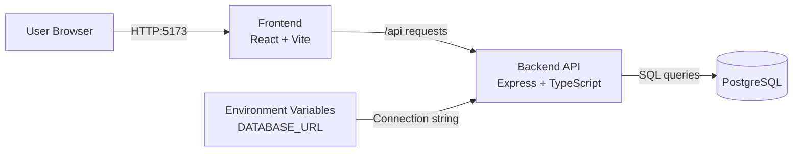

# HomeSync (PERN Monorepo)

## App Summary

HomeSync solves a common real estate pain point: buyers, agents, and collaborators often communicate across disconnected tools, which causes lost context and missed updates. The primary user is a home buyer who needs one place to view listings, collaborate with an agent, and track tasks. This application provides a single web experience where collaboration and communication happen directly in the buying workflow. The frontend offers pages for listings, chat, and a collaboration board, while the backend exposes API routes for data operations. PostgreSQL stores persistent records for users, listings, conversations, messages, and board items. A working vertical slice is implemented: toggling a task from the collaboration board updates PostgreSQL and immediately reflects in the UI. The repo is organized as a minimal beginner-friendly monorepo so frontend and backend can run together with one command.

## Tech Stack

- **Frontend framework:** React + TypeScript
- **Frontend tooling:** Vite, npm workspaces, Tailwind CSS, shadcn/ui-style components
- **Backend framework:** Express + TypeScript (`tsx` for dev runtime)
- **Database:** PostgreSQL (local), SQL schema/seed files in `db/`
- **Authentication:** Not implemented yet (planned)
- **External services/APIs:** None required for current infrastructure/vertical slice

## Architecture Diagram



## Prerequisites

Install the following software locally:

- **Node.js 20+** (includes npm): https://nodejs.org/en/download
- **PostgreSQL 16+**: https://www.postgresql.org/download/
- **psql in PATH** (usually installed with PostgreSQL): https://www.postgresql.org/docs/current/app-psql.html
- **Git**: https://git-scm.com/downloads

Verify installations:

```bash
node -v
npm -v
psql --version
git --version
```

## Installation and Setup

1. **Clone and enter the repo**

   ```bash
   git clone <your-repo-url>
   cd HomeSync
   ```

2. **Install dependencies (root + workspaces)**

   ```bash
   npm install
   ```

3. **Create your local environment file**

   - Copy `.env.example` to `.env`
   - Set `DATABASE_URL` to your local Postgres credentials.
   - Example:
     ```env
     DATABASE_URL=postgresql://postgres:<your_password>@localhost:5432/homesync
     ```

4. **Create the database**

   ```bash
   createdb -U postgres homesync
   ```

   If it already exists, this command can be skipped.

5. **Run schema and seed SQL**

   ```bash
   psql -U postgres -d homesync -f db/schema.sql
   psql -U postgres -d homesync -f db/seed.sql
   ```

6. **Optional: confirm seed worked**
   ```bash
   psql -U postgres -d homesync -c "select count(*) as users from app_user;"
   psql -U postgres -d homesync -c "select count(*) as tasks from collab_item where item_type='task';"
   ```

## Running the Application

From the repo root:

```bash
npm run dev
```

This starts both services:

- Frontend: `http://localhost:5173`
- Backend API: `http://localhost:4000`

Open `http://localhost:5173` in your browser.

## Verifying the Vertical Slice

The implemented slice is: **task toggle on Collaboration Board -> backend API -> PostgreSQL update -> updated status shown in UI**.

1. Start the app with `npm run dev`.
2. Open `http://localhost:5173/board`.
3. In the **Tasks** column, click the circle/check icon next to a task.
4. Confirm the task status changes in the UI immediately.
5. Refresh the page and confirm the new status persists.
6. Verify directly in SQL:
   ```bash
   psql -U postgres -d homesync -c "select collab_item_id, title, status from collab_item where item_type='task' order by collab_item_id;"
   ```
   You should see the toggled task status updated (for example `todo` <-> `done`).

## Repository Notes for GitHub

- `.env` and other environment files are ignored by `.gitignore`.
- `.env.example` is committed as the template.
- IDE-local folders like `.vscode/` are ignored.
- ERD is committed at `db/erd.png`.
